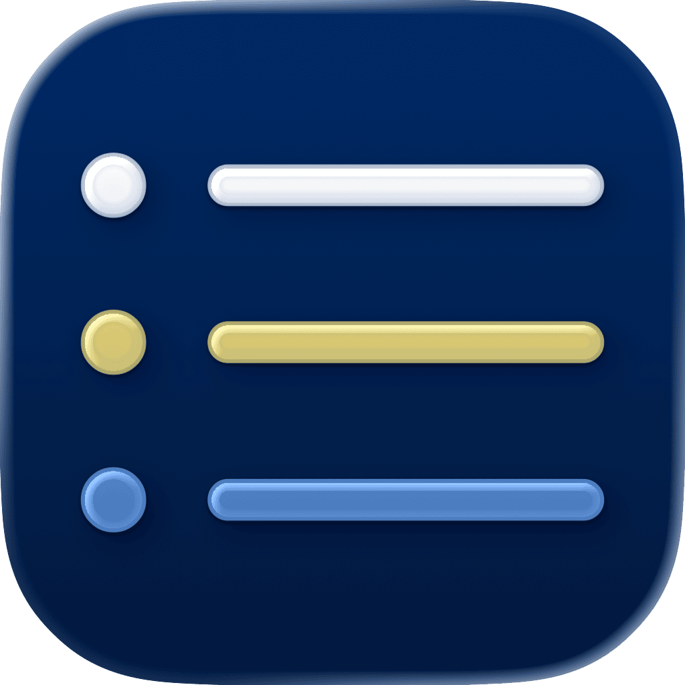

<p align="center">
    
</p>

<p align="center">
    
    
    
    <a href="https://danielsaidi.github.io/ListKit"></a>
    <a href="https://github.com/danielsaidi/ListKit/blob/main/LICENSE"></a>
</p>


# ListKit

ListKit is a SwiftUI library that provides additional list, grid, and shelf utilities, to simplify listing things in various ways.


## Installation

ListKit can be installed with the Swift Package Manager:

```
https://github.com/danielsaidi/ListKit.git
```


## Getting started

ListKit has a bunch of predefined components, as well as native view extensions.

### ListButtonGroup

The `ListButtonGroup` component lets you add quick actions in a single line: 

```swift
struct ContentView: View {

    var body: some View {
        List {
            ListButtonGroup {
                Button(action: doSomething) { ... }
                Button(action: doSomething) { ... }
                Button(action: doSomething) { ... }
                Button(action: doSomething) { ... }
            }
        }
    }
}
```

### View Extensions

ListKit also provides many view extensions to simplify common tasks:

* `.listBackgroundGradient(.blue)`
* `.listBackgroundGradient(colors: [.mint, .blue])`

See the online [documentation][Documentation] for more information.


## Documentation

The online [documentation][Documentation] has more information, articles, code examples, etc.


## Demo Application

The `Demo` folder has a demo app that lets you explore the library.


## Support My Work

You can [become a sponsor][Sponsors] to help me dedicate more time on my various [open-source tools][OpenSource]. Every contribution, no matter the size, makes a real difference in keeping these tools free and actively developed.


## Contact

Feel free to reach out if you have questions or want to contribute in any way:

* Website: [danielsaidi.com][Website]
* E-mail: [daniel.saidi@gmail.com][Email]
* Bluesky: [@danielsaidi@bsky.social][Bluesky]
* Mastodon: [@danielsaidi@mastodon.social][Mastodon]


## License

ListKit is available under the MIT license. See the [LICENSE][License] file for more info.


[Email]: mailto:daniel.saidi@gmail.com
[Website]: https://danielsaidi.com
[GitHub]: https://github.com/danielsaidi
[OpenSource]: https://danielsaidi.com/opensource
[Sponsors]: https://github.com/sponsors/danielsaidi

[Bluesky]: https://bsky.app/profile/danielsaidi.bsky.social
[Mastodon]: https://mastodon.social/@danielsaidi
[Twitter]: https://twitter.com/danielsaidi

[Documentation]: https://danielsaidi.github.io/ListKit/
[Getting-Started]: https://danielsaidi.github.io/ListKit/documentation/ListKit/getting-started
[License]: https://github.com/danielsaidi/ListKit/blob/master/LICENSE
